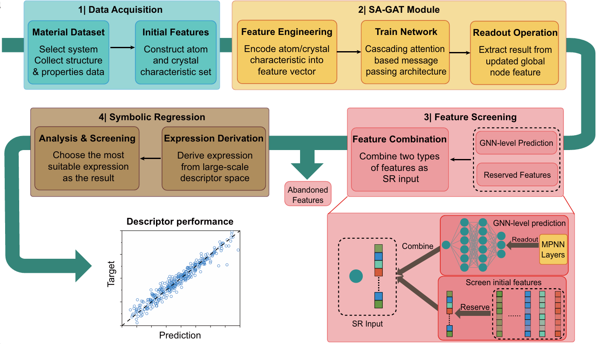

# Self-Adaptable Graph Attention Networks with Symbolic Regression

The repository implements the Self-Adaptable Graph Attention Networks with Symbolic Regression (SA-GAT-SR) in the following paper

>...

A novel computational paradigm—Self-Adaptable Graph Attention Networks integrated with Symbolic Regression (SA-GAT-SR)—that synergistically combines the predictive capability of GNNs with the interpretative power of symbolic regression. Our framework can automatically identifies and adjust attention weights so as to screen critical features from an expansive 180-dimensional feature space and achieving 23× acceleration compared to conventional SR implementations that heavily rely on first principle calculations-derived features as input.

## A short description of SA-GAT-SR

### The architecture of SA-GAT-SR



The SA-GAT-SR architecture can be divided into four steps. The data acquisition stage involves gathering materials from the system of interest to form the high quality training dataset. To construct node feature vectors, the dataset also requires a large set of corresponding atoms and crystal characteristics. Subsequently, the feature engineering algorithm respectively converts the material structure information and physical characteristics into a graph representation and nodes, global features and produce the ICs of each characteristics. After that, we obtain the well-trained GNN model and the corresponding GNN-level prediction result, which completes SA-GAT step. According to the ICs and initial prediction results given by pre-stage GNN model, the third level filters atomic and global features based on the specified number of reserved features. The input features of SR module are combined with the reserved features and the GNN module prediction. Finally, in the fourth step, SR module derives a series of expressions based on the recombined features.

### The GNN module (SA-GAT) details


The architecture of the GNN module is composed by two module, GNN and SR. In the self-adaptable encoding (SAE) algorithm of GNN module, the raw feature vector consists of scalar properties associated with atoms and unit cells from the crystal structure. The SAE assigns a weight to each characteristic and generates the initial feature vector. The blue and orange circles represent atomic and global node features, respectively. The message-passing layers include stacked node update modules, as illustrated, allowing iterative updating of feature vectors through the GNN architecture.


## A quick-start example

Below you can find a quick-start example on the perovskite materials of JARVIS-DFT (Joint Automated Repository for Various Integrated Simulations) (2021.8.18)[1] dataset, see `./train_abo3.py` for more details. We have screened $ABO_3$ and $ABX_3$ (X=F, Cl, Br, I) type perovskite materials from JARVIS-DFT dataset and youcan find them in `./rawdata/`. The details of the neural network model, which is implemented by Pytorch, can be found in `./sa_gat_module/`.


## Installation

The dependencies are managed by [conda][11]

```
python=3.8.18
numpy
transformers
pytorch=2.0.0
torch_geometric=2.4.0
multiprocessing
pymatgen=2023.8.10
```


## Train SA-GAT-SR

Our experiment is divided into three parts, which are experiments based on datasets $ABO_3$, $ABX_3$ and $AB(O|X)_3$ (the combination of the first two datasets). Take $ABO_3$ dataset as an example, you can find the entry function in `train_abo3.py`. The hyperparameters setting can be modified in `./sa_gat_module/config.py`.

### Data preparation and pre-process

The data used in our paper is put in the `./rawdata/` and you can obtain the `*.cif` files after unzip them. Please place these crystal structure files in a specific folder, e.g. `./rawdata/abo3/`. Additionally, you can train the SA-GAT-SR model on your own dataset and just need to put the `*.cif` files under the `./rawdata/` folder. The `ango.json` file store the bond angle information of the datasets.
 
The data pre-processing process will be automatically excuted after run the `train_abo3.py` and corresponding results will be stored under the `./j_datasets/`.

### Train model and post-process

The target properties of materials are included in the `.\j_datasets\jarvis_dft.json`. After training, the weight file of model is stored in the `./rules/` which is used to store various results of each instance. 

You can run the `post_process.py` to extract the ICs of each features derived by SAE algorithms and corresponding results are generated in the same directory. After that, the GNN prediction value and ICs of all features used to screen most relative features have been obtained and you can feed them into the following SR module. There are many tools to realize the SR algorithm and we choose to use the sure independence screening and specifying operator (SISSO)[2,3] to derive the final expression results. The templete script file is `templete.in`.

[1] Choudhary, K. et al. The joint automated repository for various integrated simulations (jarvis) for data-driven materials design. npj Comput. Mater. 6, 173 (2020).

[2] Ouyang, R., Curtarolo, S., Ahmetcik, E., Scheffler, M. & Ghiringhelli, L. M. Sisso: A compressed sensing method for identifying the best low-dimensional descriptor in an immensity of offered candidates. Phys. Rev. Mater. 2, 083802 (2018).

[3] Ouyang, R., Ahmetcik, E., Carbogno, C., Scheffler, M. & Ghiringhelli, L. M. Simultaneous learning of several materials properties from incomplete databases with multi-task sisso. J. Phys.: Mater. 2, 024002 (2019)

[11]: https://www.anaconda.com/docs/main
